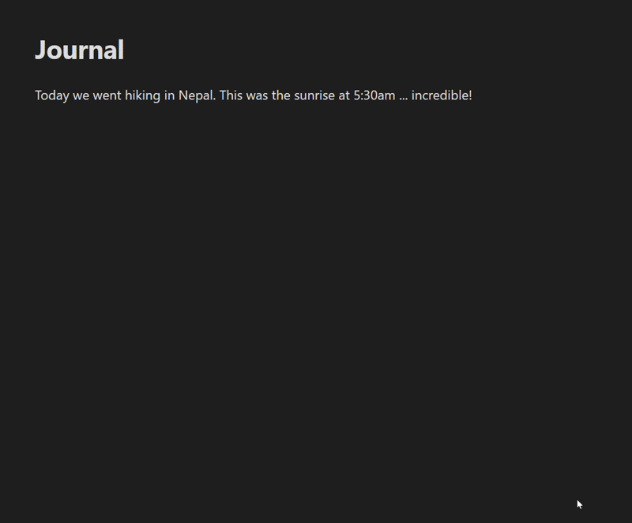

# Google Photos for Obsidian

  

<a href="https://ko-fi.com/alan_" target="_blank"></a>

This plugin let's you embed Google Photos images directly into Obsidian. When you select an image, it will save and embed a low-res thumbnail with a link back to the full-res image on Google Photos.



If your note title has a detectable date, you can have the plugin default to showing you only photos from that date. There is a toggle at the top to show all photos instead.

## How to set up

Follow the [setup instructions here](docs/Setup.md).

## Using a mobile device

You can use Google Photos on a mobile device, but due to mobile limitations you will first need to connect to Google Photos from Obsidian using a desktop device.

Once your desktop is authenticated, you can sync the plugin settings to your mobile device and it will work without any issues. If you're using any sort of sync of your Obsidian vault, this should happen automatically. Specifically you need to transfer the `data.json` file from the desktop plugin folder to your mobile device.

If you're using Obsidian Sync, you'll need to make sure the **Installed community plugins** sync option is enabled on both your desktop and mobile device for the settings to be transferred correctly.

# Usage instructions

## Insert an album

1. Open the command palette, and choose **Google Photos: Insert album**.
2. Click on an album and it will be inserted into your note as a gallery.

If you want to style or hide the title, the CSS class is `.google-photos-album-title`

## Codeblocks

You can use codeblocks to insert galleries of photos:

### Photos from the periodic note date

````
```photos
notedate
```
````

### Photos from today

````
```photos
today
```
````

### Advanced codeblock usage

You can also input your own complex queries using the Photos API search format:

https://developers.google.com/photos/library/reference/rest/v1/mediaItems/search

For example, if you wanted to show photos of food taken on every April 1st, you would use:

````
```photos
{
  "query": {
    "filters": {
      "dateFilter": {
        "dates": [{
          "year": 0,
          "month": 4,
          "day": 1
        }]
      },
      "contentFilter": {
        "includedContentCategories": [
          "FOOD"
        ]
      }
    }
  }
}
```
````

## Adjusting the visual style

If you want to adjust the styles, these are the classes used:

`.google-photos-grid-thumbnail` - the thumbnail images
`.google-photos-codeblock` - the embedded codeblock container
`.google-photos-modal-grid` - the popup modal grid container
`.google-photos-album-title` - the title for an album codeblock

## FAQs

#### Do the images have to be saved locally? Can they be remote thumbnails?

The way that Photos API generates the URLs, the direct image links are only available for a short time and then they expire. So while you could add them to your notes, they would stop working at some point.

## Attribution
Loading spinner from [loading.io](https://loading.io/)
